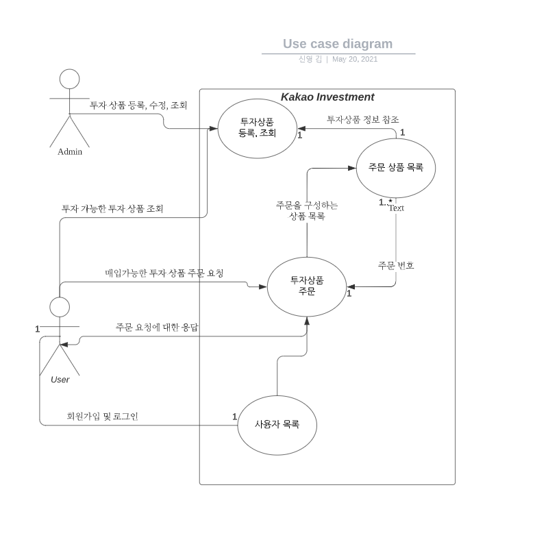
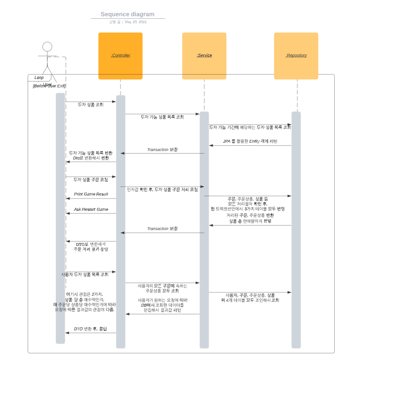
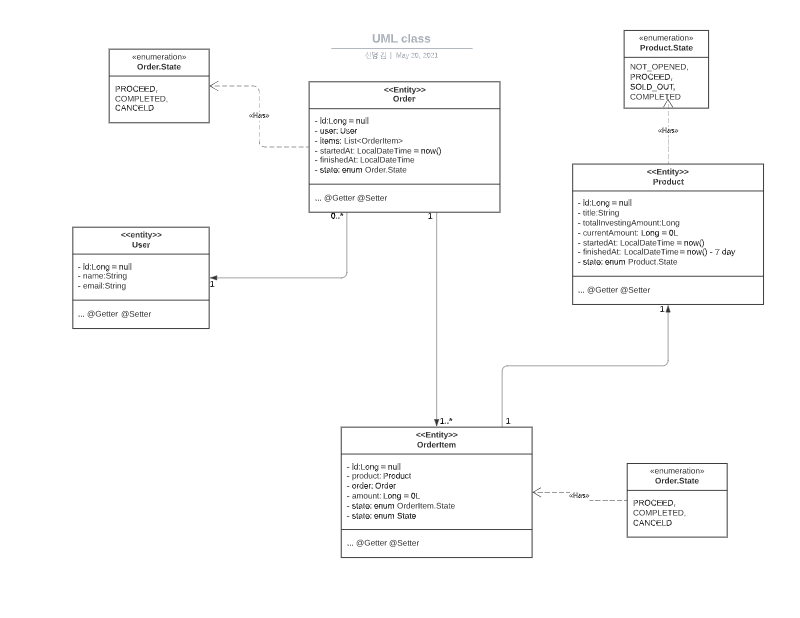

## 기능 요구 사항
- [x] 전체 투자 상품 조회 API
  - 상품 모집기간(started_at, finished_at) 내의 상품만 응답
  - 상품 ID, 상품 제목, 총 모집금액, 현재 모집금액, 투자자 수, 투자모집상태(모집중, 모집완료), 상품 모집기간
```curl
curl --location --request GET 'localhost:8080/api/product'
curl --location --request GET 'localhost:8080/api/product/proceed'
```  

- [X] 투자하기 API
  - 입력값 : 사용자 식별값, 상품 ID, 투자 금액
  - 총 투자모집 금액(total_investing_amount)를 넘어셔면 sold-out 상태를 응답
```curl
curl --location --request POST 'localhost:8080/api/order?productId=10&amount=1000' \
--header 'X-USER-ID: 2'
```
- [X] 나의 투자상품 조회 API
  - 내가 투자한 모든 상품을 반환
  - 상품 ID, 상품 제목, 총 모집금액, 나의 투자금액, 투자일시  
```curl
curl --location --request GET 'localhost:8080/api/order/user?sort=id,DESC' \
--header 'X-USER-ID: 2'
```

---
## 개발 요구 사항
- 프로젝트 구성 방법 및 관련된 시스템 아키텍처 설계 방법이 적절해야한다.
- 요구사항 구현
- 코드 가독성, 명확한 의도
- 테스트 코드 커버리지
- 트래픽 효율성

---
## UseCase Diagram


---
## Sequence Diagram


---
## Class Diagram


